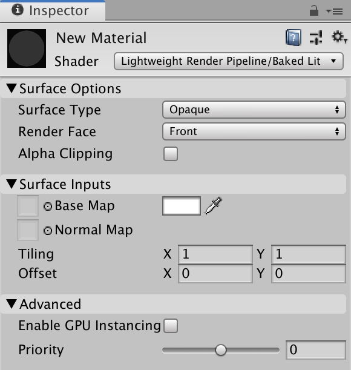

#Baked Lit
**Important:** This page is subject to change during the 2019.1 beta cycle.

# Baked Lit Shader 

Use this Shader for stylised games or apps that only require [baked lighting](https://docs.unity3d.com/Manual/LightMode-Baked.html)via [lightmaps](https://docs.unity3d.com/Manual/Lightmapping.html) and [Light Probes](https://docs.unity3d.com/Manual/LightProbes.html). This shader does not use [Physically Based Shading](shading-model.md#physically-based-shading) and has no real-time lighting, so all real-time relevant shader keywords and variants are [stripped](shader-stripping.md) from the Shader code, which makes it faster to calculate. 

## Using the Baked Lit Shader in the Editor

To select and use this Shader:

1. In your Project, create or find the Material you want to use the Shader on.  Select the **Material**. A Material Inspector window opens. 
2. Click **Shader**, and select **Lightweight Render Pipeline** > **Baked Lit**.

## UI overview 

The Inspector window for this Shader contains these elements: 

- **[Surface Options](#surface-options)**
- **[Surface Inputs](#surface-inputs)**
- **[Advanced](#advanced)**

### Surface Options 

The **Surface Options** control how the Material is rendered on a screen.

| Property           | Description                                                  |
| ------------------ | ------------------------------------------------------------ |
| **Surface Type**   | Use this drop-down to apply an **Opaque** or **Transparent** surface type to the Material. This determines which render pass LWRP renders the material in. **Opaque** surface types are always fully visible, regardless of what’s behind them. LWRP renders opaque Materials first. **Transparent** surface types are affected by their background, and they can vary according to which type of transparent surface type you choose. LWRP renders transparent Materials in a separate pass after opaque objects.  If you select **Transparent**, the **Blending Mode** drop-down appears. |
| **Blending Mode**  | Use this drop-down to determine how LWRP calculates the color of each pixel of the transparent Material by blending the Material with the background pixels. **Alpha** uses the Material’s alpha value to change how transparent an object is. 0 is fully transparent. 1 appears fully opaque, but the Material is still rendered during the Transparent render pass. This is useful for visuals that you want to be fully visible but to also fade over time, like clouds. **Premultiply** applies a similar effect to the Material as **Alpha**, but preserves reflections and highlights, even when your surface is transparent. This means that only the reflected light is visible. For example, imagine transparent glass. **Additive** adds an extra layer to the Material, on top of another surface. This is good for holograms.  **Multiply** multiplies the color of the Material with the color behind the surface. This creates a darker effect, like when you look through colored glass. |
| **Render Face**    | Use this drop-down to determine which sides of your geometry to render. **Front Face** renders the front face of your geometry and [culls](https://docs.unity3d.com/Manual/SL-CullAndDepth.html) the back face. This is the default setting.  **Back Face** renders the front face of your geometry and culls the front face.  **Both** makes LWRP render both faces of the geometry. This is good for small, flat objects, like leaves, where you might want both sides visible. |
| **Alpha Clipping** | Makes your Material act like a [Cutout](https://docs.unity3d.com/Manual/StandardShaderMaterialParameterRenderingMode.html) Shader. Use this to create a transparent effect with hard edges between the opaque and transparent areas. For example, to create blades of grass. To achieve this effect, LWRP does not render alpha values below the specified **Threshold**, which appears when you enable **Alpha Clipping**.  You can set the **Threshold** by moving the slider, which accepts values from 0 to 1. All values above your threshold are fully opaque, and all values below your threshold are invisible. For example, a threshold of 0.1 means that LWRP doesn't render alpha values below 0.1. The default value is 0.5. |

### Surface Inputs

The **Surface Inputs** describe the surface itself. For example, you can use these properties to make your surface look wet, dry, rough, or smooth. 

| Property       | Description                                                  |
| -------------- | ------------------------------------------------------------ |
| **Base Map**   | Adds color to the surface, also known as the diffuse map. To assign a Texture to the **Base Map** setting, click the object picker next to it. This opens the Asset Browser, where you can select from the Textures in your Project. Alternatively, you can use the [color picker](https://docs.unity3d.com/Manual/EditingValueProperties.html). The color next to the setting shows the tint on top of your assigned Texture. To assign another tint, you can click this color swatch. If you select **Transparent** or **Alpha Clipping** under **Surface Options**, your Material uses the Texture’s alpha channel or color. |
| **Normal Map** | Adds a normal map to the surface. With a [normal map](https://docs.unity3d.com/Manual/StandardShaderMaterialParameterNormalMap.html?), you can add surface details like bumps, scratches and grooves. To add the map, click the object picker next to it. The normal map picks up ambient lighting in the environment. |
| **Tiling**     | A 2D multiplier value that scales the Texture to fit across a mesh according to the U and V axes. This is good for surfaces like floors and walls. The default value is 1, which means no scaling. Set a higher value to make the Texture repeat across your mesh. Set a lower value to stretch the Texture. Try different values until you reach your desired effect. |
| **Offset**     | The 2D offset that positions the Texture on the mesh.  To adjust the position on your mesh, move the Texture across the U or V axes. |

### Advanced

The **Advanced** settings affect the underlying calculations of your rendering. They do not have a visible effect on your surface.

| Property                  | Description                                                  |
| ------------------------- | ------------------------------------------------------------ |
| **Enable GPU Instancing** | Makes LWRP render meshes with the same geometry and Material in one batch, when possible. This makes rendering faster. LWRP cannot render Meshes in one batch if they have different Materials or if the hardware does not support GPU instancing. |
| **Priority**              | Use this slider to determine the chronological rendering order for a Material. LWRP renders Materials with higher values first. You can use this to reduce overdraw on devices by making the pipeline render Materials in front of other Materials first, so it doesn't have to render overlapping areas twice. This works similarly to the [render queue](https://docs.unity3d.com/ScriptReference/Material-renderQueue.html) in the built-in Unity render pipeline. |
